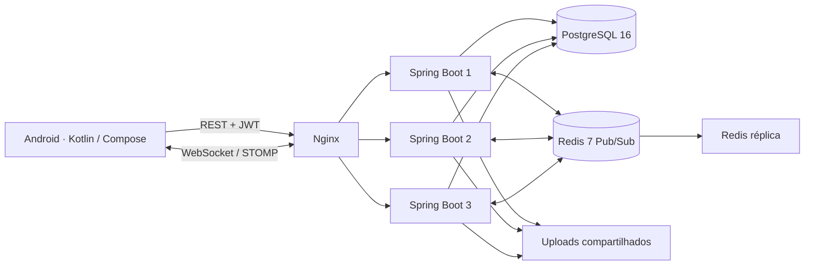

# SamusChat

[](https://github.com/Samucau1/SamusChat/actions/workflows/ci-cd.yml)


[](LICENSE)

Chat em tempo real com aplicativo Android nativo e backend Java/Spring Boot. Organize conversas em servidores e canais, troque mensagens por WebSocket e consulte o histórico persistido no PostgreSQL.

A interface escura é inspirada no Discord, com identidade SamusChat: **“+” no canto superior esquerdo para criar servidores**, **lupa no canto superior direito para procurar**, barra lateral de comunidades e canais de texto. A busca encontra seus servidores por nome ou ID; para entrar em outro servidor, informe o ID recebido de um participante.

<p align="center">
  
  
  
</p>

Capturas do aplicativo no emulador Android 35, com contas fictícias de demonstração.

## Funcionalidades

- Cadastro, login JWT, restauração de sessão e logout.
- Criação de servidores, entrada por ID e seleção de canais de texto.
- Mensagens em tempo real, histórico paginado e exibição de anexos no Android.
- API para uploads, canais, membros e cargos; autorização por participação e permissões.
- Redis Pub/Sub para distribuir mensagens entre instâncias do backend.
- Firebase opcional para notificações; login e chat funcionam sem suas credenciais.
- CI com testes, cobertura, build/lint Android e teste da infraestrutura de produção.

## Executar no PC

Pré-requisitos: **JDK 21**, **Docker Desktop em execução** e **PowerShell**. Para a interface, instale **Android Studio**, SDK 35 e Build Tools 34.0.0. O cliente atual é Android: no PC, execute-o em um emulador.

```powershell
git clone https://github.com/Samucau1/SamusChat.git
cd SamusChat
.\setup.ps1
```

O script verifica dependências, cria `.env` a partir do [modelo local](.env.example) se necessário, inicia PostgreSQL/Redis com healthchecks e executa a API por Maven Wrapper. O primeiro uso baixa dependências. `Ctrl+C` encerra a API; `docker compose stop` para os serviços sem apagar os dados.

```powershell
# Verificar os requisitos sem iniciar serviços
.\setup.ps1 -Check
# Iniciar somente PostgreSQL e Redis
.\setup.ps1 -NoRun
```

Se o PowerShell bloquear scripts, execute `powershell -ExecutionPolicy Bypass -File .\setup.ps1` após revisar o arquivo. O script não instala programas nem altera a política permanente do sistema.

Abra `samuschat-android/` no Android Studio, selecione JDK 21 e um emulador e clique em **Run**. A API padrão é `http://10.0.2.2:8080/`, endereço usado pelo emulador para acessar o PC. Saúde da API: `http://localhost:8080/actuator/health`.

Para gerar o APK pelo terminal, configure `ANDROID_HOME` ou `local.properties` com o SDK:

```powershell
cd samuschat-android
.\gradlew.bat :app:assembleDebug
```

APK: `samuschat-android/app/build/outputs/apk/debug/app-debug.apk`.

## Testar no celular

Conecte PC e Android à mesma rede e substitua o endereço abaixo pelo IPv4 do PC mostrado por `ipconfig`:

```powershell
cd samuschat-android
.\gradlew.bat :app:assembleDebug -PapiBaseUrl=http://192.168.1.10:8080/
```

Instale o APK no celular. Configure `FILE_BASE_URL=http://192.168.1.10:8080` no `.env` e reinicie `setup.ps1` para os anexos funcionarem. Se necessário, permita Java/porta 8080 no firewall para a rede privada. HTTP é habilitado apenas no build debug; release exige HTTPS.

## Arquitetura



O diagrama representa o Compose de produção. No desenvolvimento, há uma API no host e PostgreSQL/Redis em Docker. Mensagens são persistidas antes da publicação no Redis; cada backend entrega o evento às suas conexões locais. Pub/Sub não oferece replay: o histórico REST permite recuperar mensagens após reconexão.

| Camada | Tecnologias |
| --- | --- |
| Android | Kotlin, Jetpack Compose, Material 3, ViewModel, DataStore, Retrofit, OkHttp/STOMP, Coil |
| Backend | Java 21, Spring Boot 3.5, Security/JWT, BCrypt, Bean Validation, JPA |
| Dados | PostgreSQL 16, Redis 7, Flyway em produção |
| Infraestrutura | Docker Compose, Nginx, GitHub Actions, GHCR |
| Qualidade | JUnit, Mockito, MockMvc, testes de integração, JaCoCo, Android Lint |

## Testes

```powershell
cd chatapp-backend
# Com Redis local ativo, inclui o teste de distribuição entre instâncias
$env:RUN_REDIS_TESTS = 'true'
.\mvnw.cmd verify

cd ../samuschat-android
.\gradlew.bat :app:testDebugUnitTest :app:lintDebug :app:assembleDebug
```

Relatórios: `chatapp-backend/target/site/jacoco/index.html` e `samuschat-android/app/build/reports/`. O CI disponibiliza relatórios e APK debug como artifacts por sete dias. Os testes do backend usam H2; o job de smoke também verifica a stack com PostgreSQL real, três backends, Redis e Nginx.

## Publicação e deploy

O [workflow](.github/workflows/ci-cd.yml) valida backend e Android, testa o Compose de produção e publica `ghcr.io/samucau1/samuschat-backend` com tags SHA e `latest` quando `ENABLE_IMAGE_PUBLISH=true`. O deploy SSH depende de servidor, secrets e `ENABLE_PRODUCTION_DEPLOY=true`.

Consulte o [guia da etapa 13](docs/ETAPA_13.md) e o [modelo de produção](.env.prod.example). A stack usa um único host; PostgreSQL, proxy e Redis master continuam pontos únicos de falha. A réplica Redis não configura failover automático, e a substituição de instâncias pode interromper conexões WebSocket.

## Organização e documentação

```text
samuschat-android/     Aplicativo nativo Android
chatapp-backend/       API, WebSocket e testes Java
nginx/                Roteamento e limites do proxy
scripts/              Deploy, configuração e smoke tests
docs/                 Guias de implementação e operação
setup.ps1             Inicialização local no Windows
```

- [Documentação consolidada v3.0](docs/DOCUMENTACAO_V3.md)
- [Etapa 14: interface e portfólio](docs/ETAPA_14.md)
- [Android: contratos e roteiro de testes](samuschat-android/README.md)
- [CI/CD e escalabilidade](docs/ETAPA_13.md)

O Android ainda não oferece telas de upload, moderação, administração de membros ou chamadas de voz/vídeo. Push real depende da configuração Firebase. As credenciais de `.env.example` são exclusivas para desenvolvimento; em volumes PostgreSQL existentes, mudar o arquivo não altera a senha já persistida.

## Autor e licença

**[Samuel](https://github.com/Samucau1)** — estudante de Engenharia de Software, Universidade Católica de Brasília.

Projeto de portfólio sob [licença MIT](LICENSE).
