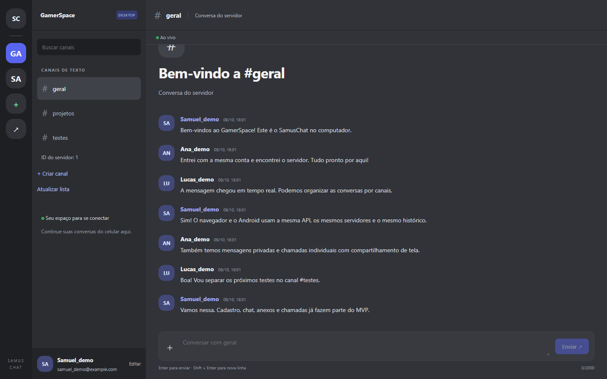
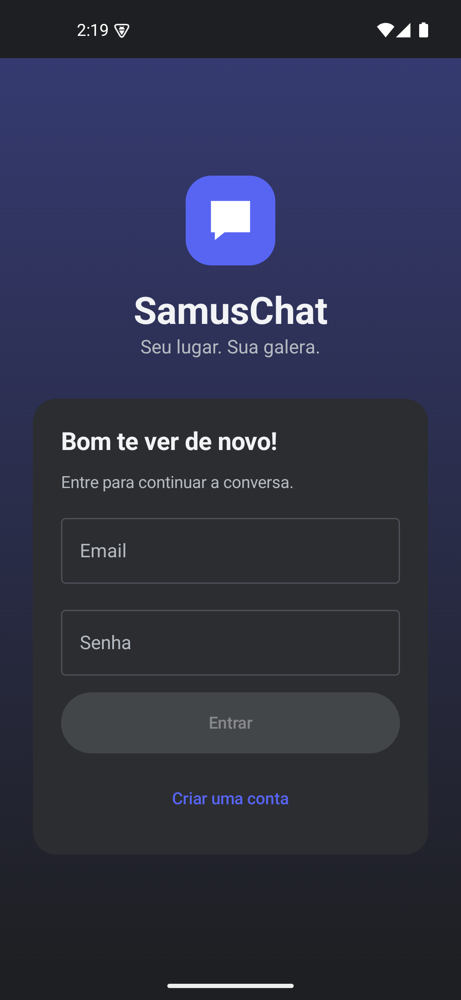
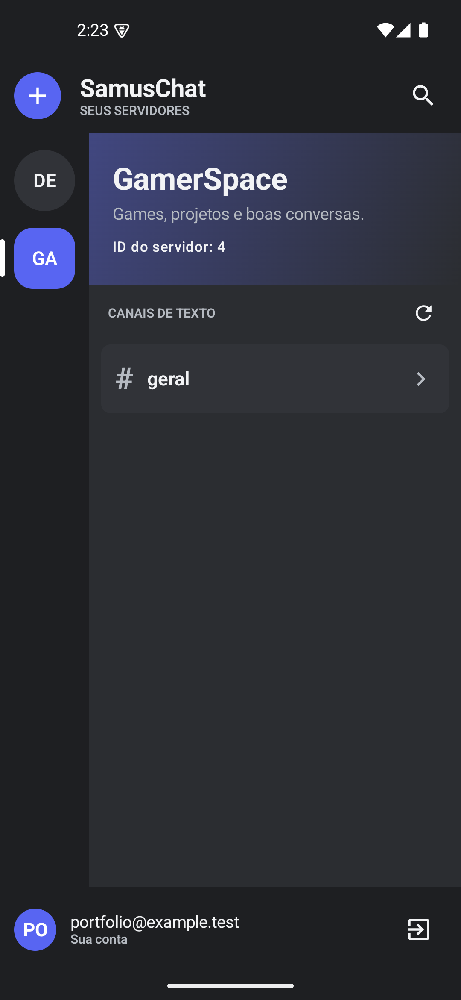
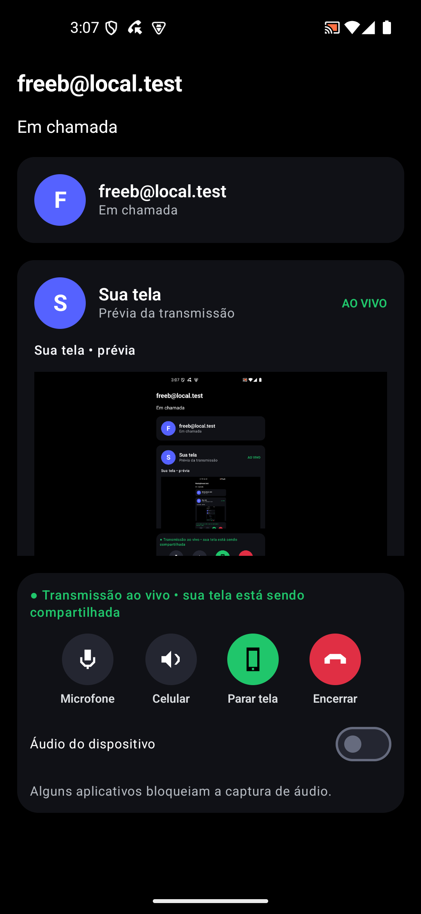
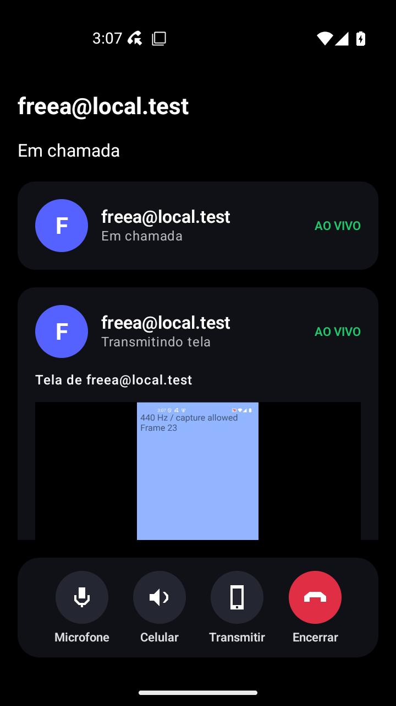
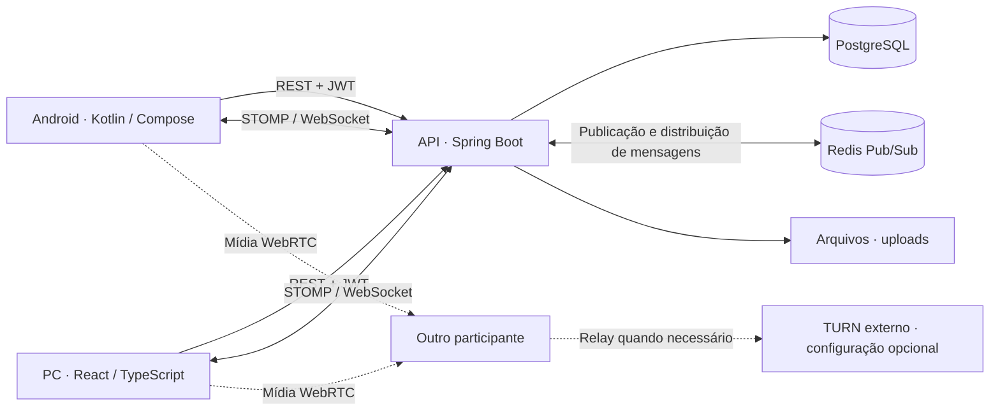

<div align="center">

# SamusChat

**Seu lugar. Sua galera. No celular e no computador.**

Conversas em comunidades, mensagens privadas e chamadas com compartilhamento de tela.
Um aplicativo Android e uma interface para PC conectados à mesma API.


[](LICENSE)

[Interfaces](#interfaces) · [Funcionalidades](#funcionalidades) · [Arquitetura](#arquitetura) · [Testes](#testes) · [Executar](#executar) · [Documentação](#documentacao)

</div>

## O projeto

O SamusChat é um MVP de comunicação para reunir pessoas em servidores e canais, continuar conversas privadas e compartilhar a tela durante chamadas. O projeto reúne **Android nativo, uma versão para computador no navegador e um backend compartilhado**: contas, servidores e histórico pertencem à mesma estrutura, independentemente da interface utilizada.

**Estado em 09/10/2026:** aplicativo Android em funcionamento e primeira entrega para PC aceita em teste manual local. A regressão de backend, Android, navegador e API foi aprovada. A próxima etapa é disponibilizar uma beta para um pequeno grupo com acesso pela internet; a hospedagem externa ainda está pendente.

<a id="interfaces"></a>

## Conheça as interfaces

### Computador · espaço para conversar



O layout para PC distribui servidores na lateral, canais em um painel próprio e a conversa na área principal. A interface usa React, TypeScript e CSS, com organização MVC e integração à API existente. A entrega atual funciona no navegador; o instalador desktop é uma etapa futura.

*Captura real feita em 09/10/2026, com contas fictícias e banco H2 descartável. As mensagens foram preparadas para apresentar a interface.*

### Android · comunidade no bolso

<table>
  <tr>
    <th>Entrada</th>
    <th>Servidores e canais</th>
    <th>Conversa</th>
  </tr>
  <tr>
    <td align="center"><a href="docs/images/login.png"></a></td>
    <td align="center"><a href="docs/images/servers.png"></a></td>
    <td align="center"><a href="docs/images/chat.png"></a></td>
  </tr>
</table>

O aplicativo usa Kotlin e Jetpack Compose. A navegação reúne Servidores, Amigos e Perfil; o chat mantém histórico paginado, atualização por WebSocket e envio de anexos. As capturas registram etapas do desenvolvimento com contas de demonstração.

### Chamadas · voz e tela compartilhada

<table>
  <tr>
    <th>Prévia de quem transmite</th>
    <th>Tela recebida pelo outro participante</th>
  </tr>
  <tr>
    <td align="center"><a href="docs/images/validacao-midia-2026-10-08/screen-local-preview.png"></a></td>
    <td align="center"><a href="docs/images/validacao-midia-2026-10-08/screen-received.png"></a></td>
  </tr>
</table>

Capturas da [validação de mídia e estabilidade de 08/10/2026](docs/REGRESSAO_MIDIA_ESTABILIDADE_2026-10-08.md), realizada em dois emuladores. O Android possui chamadas individuais, salas de chamada e transmissão da tela, incluindo áudio do dispositivo quando a versão do Android e o aplicativo capturado permitem.

<a id="funcionalidades"></a>

## O que já foi desenvolvido

| Recurso | Android | PC no navegador |
| --- | --- | --- |
| Cadastro, login, sessão e logout | Implementado | Implementado |
| Perfil e alteração do nome | Implementado; foto local por conta | Implementado; alteração do nome |
| Recuperação de senha | Implementada; envio depende de SMTP | Implementada; envio depende de SMTP |
| Criar servidor e entrar por ID | Implementado | Implementado |
| Canais de texto e histórico paginado | Implementado | Implementado |
| Mensagens de canal em tempo real | STOMP/WebSocket | STOMP/WebSocket |
| Mensagens privadas reais | Implementado | Implementado; atualização por consulta periódica |
| Anexos em canais de texto | Implementado; até 10 MB | Implementado; até 10 MB |
| Chamada individual com microfone | Implementado | Implementado |
| Compartilhamento de tela individual | Implementado | Implementado |
| Salas de chamada com vários participantes | Implementado | Próxima etapa |
| Áudio interno do dispositivo | Implementado no Android compatível | Próxima etapa |
| Login Google | Código integrado; configuração OAuth pendente | Interface de login Google pendente |
| Notificações push | Integração opcional com Firebase | Próxima etapa |

A configuração real de Google, SMTP e Firebase é independente do login por email e senha. Chamadas pela internet também exigem infraestrutura de rede adequada; a configuração de STUN/TURN é fornecida pela API.

<a id="arquitetura"></a>

## Arquitetura implementada



**Uma API, duas interfaces.** O backend concentra autenticação, regras de acesso, servidores, membros, canais, mensagens, anexos e sinalização das chamadas. PostgreSQL persiste os dados. JWT identifica a conta nas requisições e na conexão STOMP.

**Mensagens após a confirmação no banco.** O serviço publica os eventos depois do commit da transação. Redis Pub/Sub distribui as mensagens entre instâncias da API, que as entregam aos clientes por STOMP. Os clientes unificam mensagens por ID para evitar duplicação entre histórico, resposta REST e WebSocket. Pub/Sub distribui eventos em tempo real; o histórico persistido permite recarregar as conversas.

**Mídia entre participantes.** A API coordena convite, aceite, SDP e configuração ICE. Áudio e tela são transportados por WebRTC entre os participantes, com relay TURN quando necessário. As salas Android usam conexões entre participantes; o projeto ainda não possui um servidor SFU de mídia.

### Organização do código

| Camada | Organização | Responsabilidade |
| --- | --- | --- |
| Android | Compose → ViewModels → repositórios | Interface, estado da tela, sessão, REST/STOMP e mídia |
| Desktop · MVC | `views/` → `controllers/` → `models/` | Componentes React, ações/estado e contratos/repositório da API |
| Backend | Controllers → Services → Repositories | Contratos HTTP, regras de negócio e persistência |
| Tempo real | `websocket/` e Redis Pub/Sub | Autenticação STOMP e distribuição das mensagens |
| Chamadas | `call/` e clientes WebRTC | Sessões, presença, sinalização e transporte de mídia nos clientes |

```text
SamusChat/
├── chatapp-backend/       API Java, segurança, banco e sinalização
├── samuschat-android/     Aplicativo Kotlin e Jetpack Compose
├── samuschat-desktop/     Interface React e TypeScript para PC
├── docs/                 Guias, capturas e relatórios de validação
│   └── postman/           Coleção, ambiente e arquivo de teste
├── scripts/              Inicialização, validação e implantação
├── nginx/                Proxy da infraestrutura de produção
└── .github/workflows/    Pipeline de CI/CD
```

### Infraestrutura preparada para a próxima etapa

O repositório já inclui um [Compose de produção](docker-compose.prod.yml) com Nginx, três instâncias da API, PostgreSQL, Redis com réplica e volumes persistentes. O perfil de produção usa migrações Flyway e validação do esquema. A [pipeline GitHub Actions](.github/workflows/ci-cd.yml) define testes do backend com Redis, build/testes/lint Android, build desktop e smoke test dos containers.

Essa estrutura está preparada no código; a beta pública ainda precisa de servidor, domínio/HTTPS, configuração de TURN e validação em redes externas. Réplica Redis e múltiplas APIs, por si só, não garantem alta disponibilidade de toda a infraestrutura. Detalhes em [CI/CD e escalabilidade](docs/ETAPA_13.md).

### Tecnologias

| Área | Stack |
| --- | --- |
| Android | Kotlin, Jetpack Compose, ViewModel, Coroutines, DataStore, Retrofit e OkHttp |
| Computador | React 19, TypeScript, CSS, Vite e STOMP.js |
| Backend | Java 21, Spring Boot 3, Spring Security, JPA/Hibernate e JWT |
| Dados e eventos | PostgreSQL 16, Redis 7 e Flyway no perfil de produção |
| Comunicação | REST, STOMP/WebSocket e WebRTC |
| Testes | JUnit, Spring Boot Test, REST Assured, H2, JaCoCo, Android Lint, Playwright e Postman/Newman |
| Infraestrutura | Docker Compose, Nginx e GitHub Actions |

<a id="testes"></a>

## Testes e evidências

Resultados da [regressão aprovada em 09/10/2026](docs/REGRESSAO_ACEITE_DESKTOP_2026-10-09.md):

| Verificação | Resultado registrado |
| --- | --- |
| Backend · Maven `verify`, com integração Redis | **112 testes**, zero falhas, erros ou ignorados |
| Android · testes unitários | **30 testes**, zero falhas, erros ou ignorados |
| Android · lint | **0 erros**, 16 avisos e 1 informação |
| Desktop · TypeScript e build Vite | Aprovados |
| Navegador · Playwright/Chromium | **6 cenários aprovados** |
| API · Postman/Newman | **44 requisições e 100 verificações**, zero falhas |

Os cenários de navegador cobrem cadastro e sessão, perfil/logout, servidores e canais, mensagens STOMP, anexos, conversas privadas, preservação do rascunho em erro, paginação e chamada individual com tela recebida pelo segundo cliente. A coleção Postman cobre fluxos HTTP e sinalização das chamadas.

Também há uma [regressão de mídia e estabilidade com 19 cenários em emuladores](docs/REGRESSAO_MIDIA_ESTABILIDADE_2026-10-08.md), incluindo transmissão, áudio do dispositivo, controles de microfone e ciclo de vida da chamada. O aceite manual da primeira entrega PC registrou a localização e o carregamento de servidores existentes pelo usuário.

**Limites dessas evidências:** a suite de navegador usa microfone simulado e tela gerada por canvas. Postman verifica sinalização, sem transportar mídia. Qualidade do áudio físico no PC, seletor nativo de tela, interoperabilidade PC–Android, Google real e redes de operadoras ainda exigem validação específica. As contagens acima registram a execução de 09/10/2026; não representam a execução de toda a suite a cada edição deste README.

<a id="executar"></a>

## Execute localmente

Pré-requisitos: **JDK 21**, **Docker Desktop com containers Linux** e, para o navegador, **Node.js 22**. Para Android, use Android Studio e SDK Android 35.

**1. Banco, Redis e API** — na raiz do repositório:

```powershell
.\setup.ps1
```

O script prepara o `.env` local a partir do exemplo quando necessário, inicia PostgreSQL/Redis e executa a API em `http://localhost:8080`. A configuração local fica fora do Git.

**2. Versão para computador** — em outro terminal:

```powershell
cd samuschat-desktop
npm ci
npm run dev
```

Abra **http://127.0.0.1:5173**. O Vite encaminha API, WebSocket e anexos ao backend local. É possível entrar com a mesma conta utilizada no Android.

**3. Aplicativo Android** — abra `samuschat-android/` no Android Studio e execute no emulador. A URL padrão da API é `http://10.0.2.2:8080/`. O [README Android](samuschat-android/README.md) explica como gerar o APK e configurar a URL para um celular físico.

Para iniciar o ambiente Android com o launcher do projeto, use `.\iniciar-samuschat.ps1`. Consulte o [guia de inicialização automática](docs/INICIALIZACAO_AUTOMATICA.md) para seus pré-requisitos.

<a id="documentacao"></a>

## Explore a documentação

Escolha uma aba abaixo para abrir o README ou o guia da área:

<table>
  <tr>
    <th><a href="samuschat-android/README.md">📱 Android</a></th>
    <th><a href="samuschat-desktop/README.md">🖥️ Computador</a></th>
    <th><a href="chatapp-backend/README.md">⚙️ API / Backend</a></th>
  </tr>
  <tr>
    <td>Aplicativo, arquitetura, APK e testes</td>
    <td>MVC, execução no navegador e integração</td>
    <td>Contratos, segurança, dados e infraestrutura</td>
  </tr>
  <tr>
    <th><a href="docs/postman/README.md">🧪 Postman / API</a></th>
    <th><a href="docs/REGRESSAO_ACEITE_DESKTOP_2026-10-09.md">✅ Regressão e aceite</a></th>
    <th><a href="docs/README.md">📚 Todos os documentos</a></th>
  </tr>
  <tr>
    <td>Coleção importável, ambiente e Newman</td>
    <td>Resultados, cenários e limites da validação</td>
    <td>Índice dos guias e histórico do projeto</td>
  </tr>
</table>

<details>
<summary><strong>Mais detalhes por assunto</strong></summary>

| Assunto | Guia |
| --- | --- |
| Instalação e ambiente | [Guia do projeto](docs/GUIA_PROJETO.md) · [Inicialização automática](docs/INICIALIZACAO_AUTOMATICA.md) |
| Desktop | [Plano MVC](docs/DESKTOP_MVC.md) · [Integração e funcionalidades](docs/DESKTOP_API.md) |
| Autenticação | [Recuperação de senha e Google](docs/AUTENTICACAO.md) |
| Conversas | [Mensagens privadas](docs/MENSAGENS_PRIVADAS.md) · [Anexos Android](docs/ANEXOS_ANDROID.md) |
| Chamadas | [Individuais, tela e áudio](docs/CHAMADAS_INDIVIDUAIS.md) · [Salas e permissões](docs/CANAIS_DE_CHAMADA.md) |
| Mídia e estabilidade | [Regressão com capturas](docs/REGRESSAO_MIDIA_ESTABILIDADE_2026-10-08.md) |
| Infraestrutura | [CI/CD e escalabilidade](docs/ETAPA_13.md) · [Estudo de hospedagem](docs/ESTUDO_HOSPEDAGEM_CELULARES_ATUALIZACOES.md) |

</details>

---

Desenvolvido por **Samuel** · [GitHub](https://github.com/Samucau1) · [Licença MIT](LICENSE)
