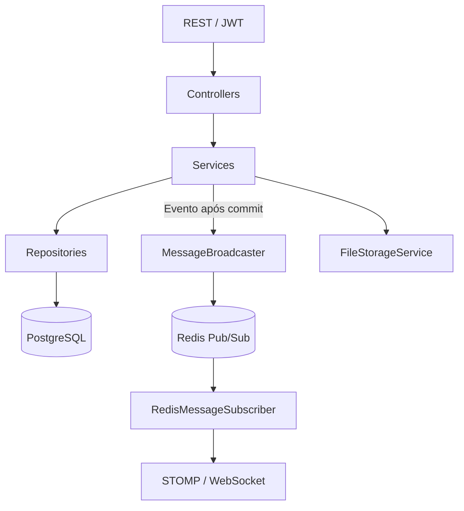

# SamusChat · API e backend

[← Apresentação do projeto](../README.md) · [Android](../samuschat-android/README.md) · [Desktop](../samuschat-desktop/README.md) · [Postman](../docs/postman/README.md)

API Java 21 e Spring Boot 3 compartilhada pelo aplicativo Android e pela interface para computador. Centraliza contas, regras de acesso, servidores, canais, mensagens, anexos e sinalização de chamadas. O frontend desktop reutiliza os contratos existentes.

## Arquitetura



O código fica em `src/main/java/com/chatapp/chatapp_backend/`:

| Pasta | Responsabilidade |
| --- | --- |
| `controller/` e `dto/` | Rotas HTTP e objetos dos contratos |
| `service/` | Regras de negócio, autenticação, mensagens e arquivos |
| `repository/` e `entity/` | Persistência JPA e entidades |
| `security/` | JWT, filtros e limites de requisições |
| `websocket/` | Autenticação STOMP e eventos de mensagens |
| `call/` | Chamadas individuais, salas, presença e configuração ICE |
| `config/` e `strategy/` | Integrações e estratégias de notificações |

PostgreSQL guarda o histórico. Redis distribui eventos entre instâncias, depois da confirmação da transação. Em falha de publicação Redis, há entrega local como fallback; isso não garante distribuição entre todas as instâncias. Consulte [CI/CD e escalabilidade](../docs/ETAPA_13.md).

A API guarda e coordena a sinalização WebRTC; o transporte de áudio e tela ocorre nos clientes, diretamente ou por TURN. Não há SFU de mídia no backend.

## Executar em desenvolvimento

Pré-requisitos: JDK 21 e Docker Desktop com Docker Compose v2 e containers Linux. Na **raiz do repositório**:

```powershell
.\setup.ps1
```

O script inicia PostgreSQL/Redis e executa a API na porta `8080`. Ele cria `.env` a partir de `.env.example` quando o arquivo local não existe. Para conferir o ambiente sem iniciar a aplicação:

```powershell
.\setup.ps1 -Check
```

Configurações locais incluem banco, segredo JWT, URL pública dos anexos e integrações opcionais. No emulador Android, a API usa `10.0.2.2`; no celular físico, o endereço precisa ser acessível pela rede do dispositivo. Configure também `FILE_BASE_URL` para que os anexos sejam alcançáveis pelo cliente.

## Contratos principais

As respostas REST usam o envelope `{ success, data, message, error }`. Rotas protegidas recebem `Authorization: Bearer <JWT>`. Permissões e participação no servidor são verificadas no backend.

| Área | Rotas de referência |
| --- | --- |
| Cadastro e login | `POST /api/auth/register`, `POST /api/auth/login` |
| Perfil | `GET /api/users/me`, `PUT /api/users/me/username` |
| Servidores | `GET/POST /api/servers`, `GET /api/servers/{id}`, `POST /api/servers/{id}/join` |
| Canais | `POST /api/servers/{id}/channels` |
| Mensagens | `GET/POST /api/channels/{channelId}/messages` |
| Conversas privadas | `/api/direct-messages` |
| Chamadas | `/api/calls` e rotas de presença/salas |

O histórico usa paginação. Mensagens de canal também são entregues por STOMP: conexão WebSocket nativa em `/ws/websocket`, JWT no frame `CONNECT` e assinatura em `/topic/channel/{id}`.

A [coleção Postman](../docs/postman/README.md) contém exemplos executáveis de requisições, anexos, permissões e sinalização. Consulte [autenticação](../docs/AUTENTICACAO.md), [mensagens privadas](../docs/MENSAGENS_PRIVADAS.md) e [chamadas](../docs/CHAMADAS_INDIVIDUAIS.md) para os contratos detalhados.

## Testes

Na pasta `chatapp-backend/`, com Redis local disponível:

```powershell
$env:RUN_REDIS_TESTS = 'true'
.\mvnw.cmd verify '-Dspring.profiles.active=test'
```

Em 09/10/2026: **112 testes aprovados**, sem falhas, erros ou testes ignorados. A suite usa H2 por contexto de teste; a integração Redis usa Redis real. Relatórios ficam em `target/surefire-reports/` e a cobertura JaCoCo em `target/site/jacoco/`. Esses arquivos gerados ficam fora do Git.

Para testar HTTP ou navegador sem criar contas no banco normal, inicie uma API descartável na raiz:

```powershell
.\scripts\start-desktop-test-api.ps1 -Port 18081
```

Esse launcher define H2 em memória explicitamente e mantém a API de desenvolvimento na porta `8080` separada. Ao encerrar o processo, os dados desse banco de teste são descartados. A coleção Postman registrou **44 requisições e 100 verificações aprovadas**. Veja o [relatório da regressão](../docs/REGRESSAO_ACEITE_DESKTOP_2026-10-09.md).

## Produção e integrações

O [Compose de produção](../docker-compose.prod.yml) prepara Nginx, três APIs, PostgreSQL, Redis com réplica e volumes. `application-prod.properties` habilita Flyway e validação do esquema. Configuração de domínio/HTTPS, servidor TURN, segredos e hospedagem externa ainda faz parte da implantação da beta.

Recuperação por email depende de SMTP configurado. Login Google possui contratos e validação de identidade implementados, mas a configuração OAuth real está pendente. Firebase é opcional; sem credenciais, o fluxo básico de autenticação e chat continua disponível conforme a estratégia local de notificações.

## Documentação complementar

- [Guia de ambiente e arquitetura](../docs/GUIA_PROJETO.md)
- [Autenticação, recuperação e Google](../docs/AUTENTICACAO.md)
- [Salas, perfis e permissões](../docs/CANAIS_DE_CHAMADA.md)
- [CI/CD e escalabilidade](../docs/ETAPA_13.md)
- [Postman e Newman](../docs/postman/README.md)
- [Índice de documentação](../docs/README.md)
