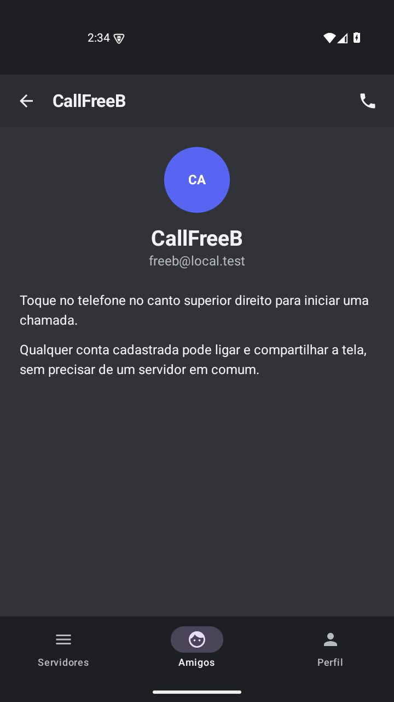
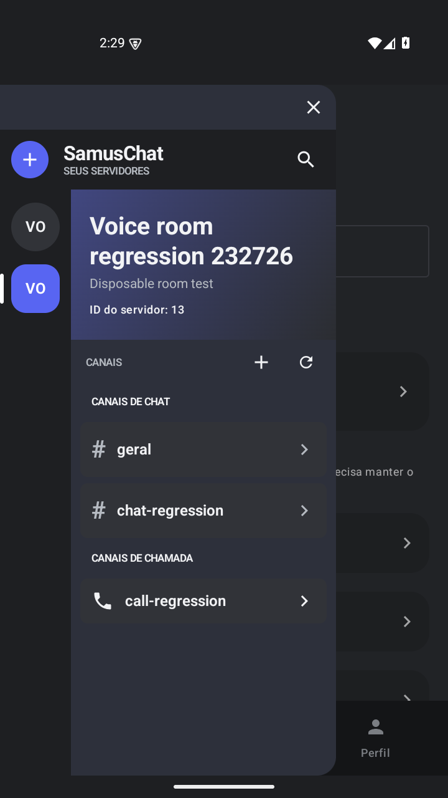
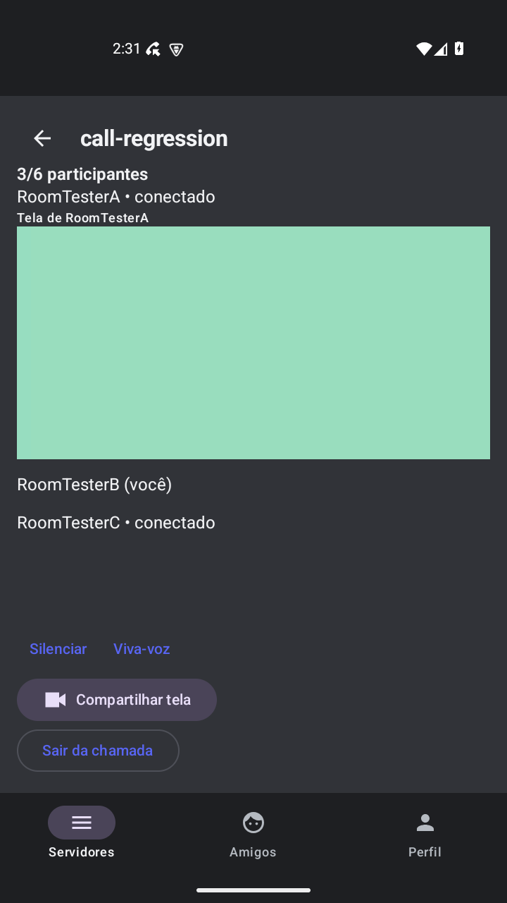

# Perfis, permissões e canais de chamada

Etapa desenvolvida em `feature/call-channels`, sobre a `main` após a integração das chamadas individuais no PR #1.

## Uso

Na aba **Amigos**, pesquise pelo nome ou e-mail de um contato da lista e abra seu perfil. O ícone de telefone no canto superior direito inicia uma chamada individual. Qualquer conta cadastrada pode ligar, independentemente do cargo ou de participar de um servidor em comum. O destinatário ainda precisa aceitar e manter o aplicativo aberto para receber o convite. Alex é uma conversa demonstrativa, sem conta real ou ligação.

Durante a chamada, o botão com ícone de câmera **Compartilhar tela** abre a autorização do Android. Ele transmite a tela; não abre a câmera física. O acesso ao microfone e a autorização de captura continuam obrigatórios. Mute silencia as amostras sem reiniciar o capturador. Áudio de outros aplicativos continua disponível nas chamadas individuais quando o Android e o aplicativo de origem permitem captura.

Em **Servidores**, o criador pode tocar em **Criar canal**, escolher **Chat** ou **Chamada**, informar um nome e salvar. Os canais aparecem separados por tipo. Canais de chat abrem as mensagens existentes; canais de chamada abrem uma sala com **Entrar na chamada**.

Qualquer membro do servidor pode entrar na sala, conversar, silenciar o microfone, usar viva-voz, transmitir a própria tela pelo botão de câmera e sair. Cada transmissão recebida aparece identificada pelo nome do participante. É possível navegar para outras telas mantendo a chamada; **Voltar à chamada** retorna à sala. Sair ou encerrar pela notificação libera a captura e o serviço.

## Capturas reais

Contas fictícias em emuladores Android API 35. A superfície colorida recebida pertence ao aplicativo independente de teste `call-test-tone`.

| Perfil com telefone | Chamada individual com botão de câmera |
| --- | --- |
|  |  |

| Canais de chat e chamada | Sala com três participantes e tela recebida |
| --- | --- |
|  |  |

[Tela recebida pelo terceiro participante](images/call-room-receiver-c.png) e [transmissão individual recebida](images/individual-screen-received.png).

## Permissões e persistência

- Convites individuais exigem contas existentes e autenticadas, sem servidor compartilhado. Apenas os participantes acessam a sinalização da chamada.
- Criação de canais continua exigindo administrador no backend. O aplicativo mostra a ação ao criador do servidor.
- Entrada e transmissão em canais exigem ser membro do servidor, sem cargo especial.
- Tipos de canal aceitos: `TEXT` e `VOICE`; nomes devem conter de 1 a 255 caracteres após remover espaços externos.
- Uma conta entra em uma sala por vez e não recebe/inicia uma ligação individual enquanto estiver nela, inclusive quando estiver sozinha.
- A migração Flyway V3 associa sessões aos canais e cria a presença persistida. Presenças sem heartbeat por 45 segundos são removidas da sala ao consultar/entrar novamente; suas conexões são encerradas.

As salas usam WebRTC em malha, com uma conexão para cada outro participante. O limite inicial é **6 participantes por sala**. Cada cliente compartilha uma única captura de microfone e tela entre suas conexões. A sinalização reutiliza o ciclo oferta/resposta autenticado; cada participante recebe apenas suas próprias sessões, sem acessar o SDP das conexões dos outros. Os endpoints de presença da sala usam um orçamento próprio de 360 requisições/minuto por IP, separado das 180 de sinalização e do limite de mensagens/administração. Isso permite os heartbeats de seis participantes atrás do mesmo NAT sem consumir o orçamento das mensagens.

## Reproduzir a regressão

No backend, com Redis local disponível:

```powershell
$env:RUN_REDIS_TESTS = 'true'
.\mvnw.cmd verify '-Dspring.profiles.active=test'
```

No Android, com JDK 21 e SDK 35:

```powershell
.\gradlew.bat :app:testDebugUnitTest :app:assembleDebug :app:lintDebug `
  :call-test-tone:assembleDebug -PcallTestTone=true `
  '-PapiBaseUrl=http://10.0.2.2:8081/' -PcallsForceRelay=true
```

Inicie a API na porta 8081 com o banco separado `samuschat_calls_test`, Flyway e TURN local, seguindo o [guia de chamadas](CHAMADAS_INDIVIDUAIS.md#reproduzir-testes). Apenas em emuladores descartáveis:

```powershell
powershell -NoProfile -ExecutionPolicy Bypass -File scripts/test-calls-emulator.ps1 `
  -Adb '.android-sdk/platform-tools/adb.exe' `
  -Caller emulator-5556 -Callee emulator-5558 -Prepare -ResetDisposableEmulators

powershell -NoProfile -ExecutionPolicy Bypass -File scripts/test-call-rooms-emulator.ps1 `
  -Adb '.android-sdk/platform-tools/adb.exe' -ResetDisposableEmulators
```

O primeiro script usa contas sem servidores para verificar o telefone no perfil, convite individual, mute, tela e áudio do dispositivo. O segundo prepara três membros de um servidor, cria os dois tipos de canal pela interface e verifica mídia entre três clientes. Ambos limpam dados somente dos emuladores explicitamente indicados; não use aparelhos ou sessões pessoais. A autorização de compartilhamento esperada está em inglês.

Os relatórios e logs ficam em `chatapp-backend/target/` e `samuschat-android/app/build/`, fora do Git.

Os resultados desta etapa estão na [regressão de perfis e canais de chamada](REGRESSAO_CANAIS_DE_CHAMADA.md).

## Limites

Não há envio de vídeo da câmera física nem convite push com o aplicativo fechado. O diretório inicial mostra até 100 contas; a busca no Android filtra essa lista. O limite de seis participantes evita crescimento ilimitado de conexões, mas não comprova desempenho em todos os aparelhos. Nesta etapa, as salas transmitem microfone e tela; o controle de áudio interno de aplicativos permanece nas chamadas individuais. Testes em dispositivos físicos, Bluetooth, mudança de rede e chamadas longas continuam necessários.
