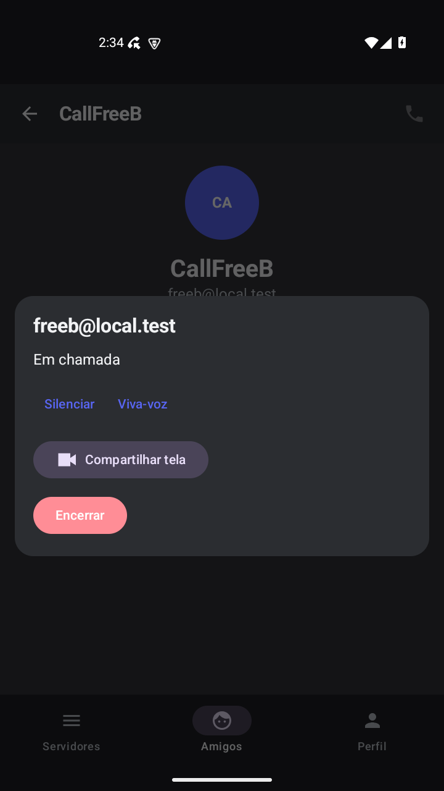
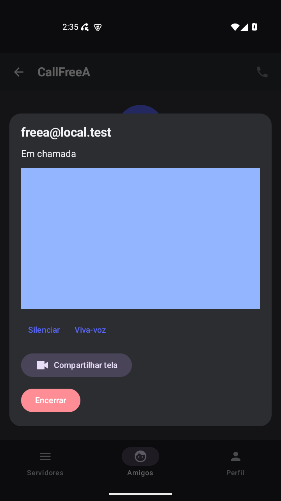
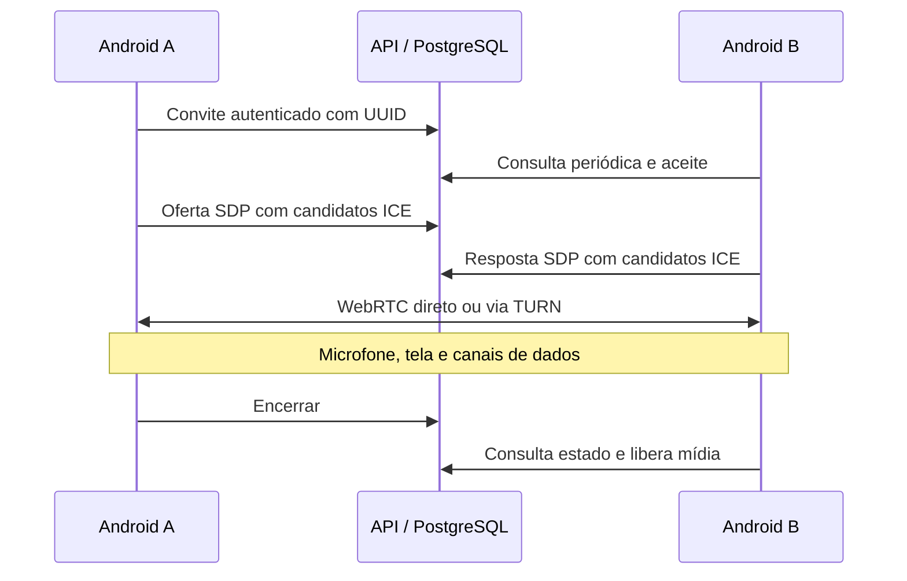

# Chamadas individuais, tela e áudio do dispositivo

Implementação inicial na branch `feature/individual-calls`, evoluída em `feature/call-channels`. Agora qualquer conta cadastrada pode ligar para outra conta, sem exigir um servidor em comum. O contato Alex continua sendo apenas demonstração e não recebe chamadas. A etapa de [perfis e canais de chamada em grupo](CANAIS_DE_CHAMADA.md) descreve o novo design e suas permissões.

## Funcionamento

Quem compartilha também vê **Sua tela • prévia** dentro da chamada. A prévia usa a mesma faixa de vídeo enviada ao outro participante, sem uma segunda captura. Se os dois compartilharem, cada um poderá ver a própria prévia e a tela recebida; o painel permite rolagem. Parar o compartilhamento ou encerrar a ligação remove a prévia.

Na aba Amigos, abra o perfil de um contato real e toque no telefone no canto superior direito. Com os dois aplicativos abertos e autenticados, aceite no outro aparelho. A permissão de microfone é solicitada antes de iniciar ou aceitar. Durante a ligação há controles de microfone, viva-voz, compartilhamento de tela pelo botão de câmera e encerramento.

**Compartilhar tela** abre a autorização do Android. A captura começa somente após essa autorização; cada nova sessão solicita uma nova permissão. Em Android 10 ou superior, o controle **Áudio do dispositivo** pode enviar também o som dos aplicativos que permitem captura. Parar o compartilhamento interrompe tela e áudio interno, preservando a ligação. Encerrar ou sair da conta libera os recursos de mídia. A notificação da chamada também oferece Encerrar.

O destinatário precisa manter o aplicativo aberto para receber o convite nesta versão. Chamadas já iniciadas utilizam serviço em primeiro plano e podem continuar enquanto outro aplicativo é exibido. Chamadas de grupo são oferecidas nos canais de chamada dos servidores. Vídeo da câmera, histórico, gravação e notificações push de chamadas ainda não foram adicionados.

## Capturas da versão atual

Capturas reais de dois emuladores Android API 35 em 02/10/2026, usando apenas contas fictícias de regressão.

| Ligação conectada | Transmissão recebida |
| --- | --- |
|  |  |

A superfície verde pertence ao aplicativo separado `call-test-tone`, que alterna cores e reproduz um tom de 440 Hz. Os contadores de quadros decodificados e de amostras recebidas complementam a captura visual; um print sozinho não comprova a transmissão de áudio.

O [relatório da etapa atual](REGRESSAO_CANAIS_DE_CHAMADA.md) registra esta execução; os [perfis e canais de chamada](CANAIS_DE_CHAMADA.md#capturas-reais) têm capturas adicionais. As imagens `call-connected.png` e `screen-received.png` preservam a etapa anterior.

## Arquitetura da chamada



A sinalização usa REST autenticado e estado persistido no PostgreSQL. Isso permite consultar a mesma chamada em diferentes instâncias da API sem depender de uma sessão WebSocket em memória. O cliente consulta a cada cinco segundos enquanto está aberto e sem chamada, e a cada dois segundos durante uma chamada. A mídia não passa pelos endpoints REST nem pelo Redis.

O SDK `io.github.webrtc-sdk:android:137.7151.05` transporta o microfone em uma faixa de áudio e a tela em uma faixa de vídeo. O compartilhamento usa `MediaProjection` e `ScreenCapturerAndroid`, com limite aproximado de 960 pixels no maior lado e 15 quadros/s. Um canal de dados confiável comunica início/fim do compartilhamento.

O áudio interno usa `AudioPlaybackCapture`: PCM16 mono, 16 kHz, pacotes de 20 ms. Ele é enviado em canal de dados não ordenado, sem retransmissões, com filas limitadas a aproximadamente 100 ms. O receptor reproduz via `AudioTrack`. São aproximadamente 256 kbit/s de áudio bruto, além dos demais fluxos e cabeçalhos. Esta primeira versão não implementa codec adicional, buffer adaptativo nem sincronização fina entre tela e áudio interno.

O capturador inclui usos MEDIA/GAME e exclui o UID do próprio SamusChat para evitar recapturar a conversa. A permissão de captura definida pelo aplicativo de origem continua sendo respeitada. Conteúdo protegido ou áudio de aplicativos que bloqueiam captura pode resultar em silêncio ou imagem indisponível.

## API e persistência

Todos os endpoints exigem o JWT da conta:

| Endpoint | Finalidade |
| --- | --- |
| `GET /api/calls/contacts` | Até 100 outras contas cadastradas, sem exigir servidor em comum |
| `GET /api/calls/ice` | Configuração STUN/TURN e credenciais TURN temporárias |
| `POST /api/calls` | Convite com `callee` e `requestId` UUID |
| `GET /api/calls` | Chamadas não encerradas da conta e atualização de presença |
| `GET /api/calls/{id}` | Estado e sinalização, apenas para os participantes |
| `POST /api/calls/{id}` | `action`: accept, decline, offer, answer ou end; SDP quando aplicável |

A migração Flyway `V2__individual_calls.sql` cria `call_sessions`. Os estados são RINGING, CONNECTING, ACTIVE, ENDED, DECLINED e EXPIRED. ACTIVE significa que a resposta SDP foi registrada; a interface só mostra **Em chamada** após a conexão WebRTC confirmar a mídia.

Bloqueios transacionais nos usuários serializam convites concorrentes, impedindo duas chamadas simultâneas por conta. O UUID torna a repetição do convite idempotente. Apenas o destinatário aceita ou recusa; somente os participantes leem ou alteram a sessão. Oferta e resposta têm limite de 64 KiB. O cliente preserva o SDP gerado para repetir uma requisição sem renegociar silenciosamente.

Convites expiram em 45 segundos. A negociação tem limite de 105 segundos desde a criação; após o aceite, a ausência de atualização de qualquer participante por 45 segundos expira a sessão. O cliente também encerra negociações sem conexão e falhas prolongadas de comunicação. A manutenção roda a cada 30 segundos, limpa SDP de sessões expiradas e remove sessões terminais criadas há mais de 24 horas. Não se trata de histórico permanente. O limite específico de chamadas é 180 requisições/minuto por IP; muitos usuários atrás do mesmo NAT podem exigir ajuste.

## Configuração

O backend aceita:

```dotenv
CALLS_STUN_URL=stun:seu-servidor:3478
CALLS_TURN_URL=turn:seu-servidor:3478?transport=udp
CALLS_TURN_SECRET=segredo-compartilhado-com-coturn
```

O segredo fica no backend e no Coturn. O Android recebe credenciais temporárias com validade de uma hora, assinadas com HMAC-SHA1, e não recebe o segredo compartilhado. Configure Coturn com `use-auth-secret`, `static-auth-secret` e realm correspondente à instalação. O aplicativo não renova essas credenciais durante a chamada nesta versão; chamadas longas precisam de validação adicional.

As variáveis estão documentadas em `.env.prod.example` e repassadas por `docker-compose.prod.yml`. O compose de produção não instala um servidor TURN. Para redes diferentes, configure um TURN alcançável, endereço público correto e portas de relay liberadas. Em produção, use HTTPS para a API e credenciais próprias. A mídia WebRTC usa os mecanismos de transporte criptografado do SDK; não foi implementada uma camada adicional de verificação de identidade entre aparelhos.

Sem STUN/TURN configurado, conexões diretas podem funcionar em algumas redes, mas não há garantia de conectividade. `-PcallsForceRelay=true` força TURN no build Android para testes; o padrão é `false`.

## Reproduzir testes

Pré-requisitos: JDK 21, SDK Android 35, dois emuladores descartáveis, PostgreSQL e Redis locais. O backend dos testes de integração automatizados usa H2; o teste de interface usa um banco PostgreSQL separado, `samuschat_calls_test`. Não reutilize contas ou dados pessoais nos emuladores que serão limpos.

No backend, antes de iniciar o JAR:

```powershell
$env:RUN_REDIS_TESTS = 'true'
.\mvnw.cmd verify '-Dspring.profiles.active=test'
```

No Windows, pare o JAR de teste antes de recompilá-lo, pois ele pode bloquear o empacotamento. Com o banco de teste criado, suba o backend na porta 8081 com Flyway habilitado e `ddl-auto=validate`. Para os dois emuladores no mesmo computador, o teste usou Coturn em Docker, escutando apenas em localhost:

```powershell
docker run -d --name samuschat-call-turn `
  -p 127.0.0.1:3478:3478/udp -p 127.0.0.1:3478:3478/tcp `
  coturn/coturn:4.6.3 -n --log-file=stdout --realm=samuschat-test `
  --use-auth-secret --static-auth-secret=local-call-experiment-only `
  --min-port=49160 --max-port=49180 --no-tls --no-dtls --no-cli --allow-loopback-peers

java -jar target/chatapp-backend-0.0.1-SNAPSHOT.jar `
  --server.port=8081 `
  --spring.datasource.url=jdbc:postgresql://localhost:5432/samuschat_calls_test `
  --spring.flyway.enabled=true --spring.jpa.hibernate.ddl-auto=validate `
  --app.notifications.strategy=log `
  '--app.calls.turn-url=turn:10.0.2.2:3478?transport=udp' `
  --app.calls.turn-secret=local-call-experiment-only
```

Esse TURN serve apenas ao cenário local com os dois clientes forçados a relay dentro do mesmo contêiner. Não é uma configuração de produção ou para celulares externos. A chave acima é exclusiva de demonstração local. Para criar o banco uma única vez no PostgreSQL de desenvolvimento, use `docker exec chatapp-postgres psql -U postgres -c "CREATE DATABASE samuschat_calls_test;"`.

Na pasta `samuschat-android`:

```powershell
.\gradlew.bat :app:testDebugUnitTest :app:assembleDebug :app:lintDebug `
  :call-test-tone:assembleDebug -PcallTestTone=true `
  '-PapiBaseUrl=http://10.0.2.2:8081/' -PcallsForceRelay=true
```

O módulo opcional `call-test-tone` produz um APK independente, com outro UID, que reproduz um tom de 440 Hz e altera a tela periodicamente. Ele permite testar mídia capturada pelo Android, incluindo a política que proíbe captura. Não faz parte do aplicativo SamusChat.

Na raiz da branch, após aguardar o backend iniciar, com ambos os emuladores acessíveis via ADB:

```powershell
powershell -NoProfile -ExecutionPolicy Bypass -File scripts/test-calls-emulator.ps1 `
  -Adb 'CAMINHO_DO_SDK/platform-tools/adb.exe' `
  -Caller emulator-5554 -Callee emulator-5556 -Prepare -ResetDisposableEmulators
```

`-Prepare -ResetDisposableEmulators` reinstala o APK, limpa os dados do SamusChat nesses emuladores e prepara contas locais sem servidores em comum, abrindo os perfis com o telefone. O teste espera os textos do diálogo de autorização do Android em inglês. Sem `-Prepare`, reutiliza os aplicativos autenticados e com os perfis abertos. Ele limpa os buffers de log dos emuladores para não aceitar evidência antiga. Relatórios ficam em `samuschat-android/app/build/call-e2e/`, fora do Git.

## Resultados e limites

A [regressão de 02/10/2026](REGRESSAO_CHAMADAS.md) repete a validação nesta máquina e adiciona verificação de processos após stress e capturas reais da ligação e da transmissão. Os resultados abaixo registram a validação inicial de 01/10/2026.

Validação local em 01/10/2026, Windows, JDK 21 e dois emuladores Android API 35:

| Verificação | Resultado |
| --- | --- |
| Backend `verify`, incluindo Redis e regressões existentes | 78 testes, zero falhas, erros ou ignorados; empacotamento aprovado |
| Android `testDebugUnitTest` | 20 testes, zero falhas ou erros |
| Android `assembleDebug` e `lintDebug` | Build aprovado; zero erros e 10 avisos de lint |
| Chamada entre dois clientes Android | Conexão e recebimento RTP nos dois lados, ambos usando TURN relay |
| Tela | 105 quadros decodificados no receptor na amostra registrada |
| Áudio interno permitido | 650 pacotes e 184.629 amostras não nulas na primeira medição |
| Aplicativo que bloqueia captura | Contador de pacotes continuou aumentando, sem novas amostras não nulas após estabilização |
| Stress do microfone | 25 ciclos / 50 toques, chamada preservada após a correção |
| Ciclo de compartilhamento | Parar, solicitar nova autorização, reiniciar e encerrar remotamente durante captura: aprovado |
| Encerramento | Recusa no sentido inverso e serviço de chamada ausente nos dois emuladores: aprovado |
| Regressão da navegação existente | Amigos, Alex, Perfil e servidores; 50 ciclos / 200 toques em 55,6 segundos, mesmo processo e interface responsiva |

O UiAutomator apresentou uma indisponibilidade transitória de hierarquia durante uma transição. A leitura foi reforçada para repetir até três vezes e rejeitar dumps antigos; a função atualizada foi verificada nos dois emuladores. Os relatórios completos são gerados localmente nas pastas de build, sem APKs, logs ou credenciais de execução no commit.

Os testes JVM novos cobrem regras de aceite, estados terminais, tamanho/fila de áudio e inclusão de candidatos no SDP. No backend, cobrem autorização dos participantes, servidor compartilhado, ocupação, idempotência, ciclo oferta/resposta, expiração e credenciais TURN. Os testes de interface usam ADB/UiAutomator; não são testes instrumentados de Compose.

Testes em emuladores não comprovam qualidade acústica, cancelamento de eco em aparelhos físicos, funcionamento em operadoras diferentes ou comportamento de todos os fabricantes. A implementação ainda requer essa validação antes de distribuição ampla. Também não foram validados aqui chamadas de longa duração, renovação de TURN, mudança de rede, Bluetooth, recepção com aplicativo fechado ou carga de muitos usuários simultâneos.

## Correções encontradas na validação

- A sinalização inicialmente podia publicar SDP sem candidatos ICE. A geração agora reúne os candidatos retornados pelo SDK, aguarda um intervalo sem novos candidatos e os inclui nas respectivas seções de mídia. Falta de candidato resulta em erro e encerramento, em vez de uma chamada permanentemente conectando. Testes JVM cobrem seções, duplicação e o mesmo candidato em diferentes mídias.
- O stress de microfone revelou um crash em `WebRtcAudioRecord`: ativar/desativar repetidamente a faixa reiniciava a captura e provocava uma disputa entre threads. O botão passou a usar `JavaAudioDeviceModule.setMicrophoneMute`, que mantém o capturador e silencia as amostras. O indicador de uso do microfone do Android pode permanecer ativo enquanto a chamada estiver aberta. A verificação dessa correção usa toques reais nos emuladores.
- O serviço de chamada é iniciado durante a interação de ligar/aceitar, antes de aguardar a outra pessoa, e é liberado se a operação falhar. Isso evita depender da permissão de iniciar um novo serviço de microfone quando o aplicativo já estiver em segundo plano.

Referências: [módulo de áudio do WebRTC](https://webrtc.googlesource.com/src/+/refs/heads/main/sdk/android/api/org/webrtc/audio/JavaAudioDeviceModule.java), [MediaProjection](https://developer.android.com/media/grow/media-projection), [captura de áudio de outros aplicativos](https://developer.android.com/media/platform/av-capture).
