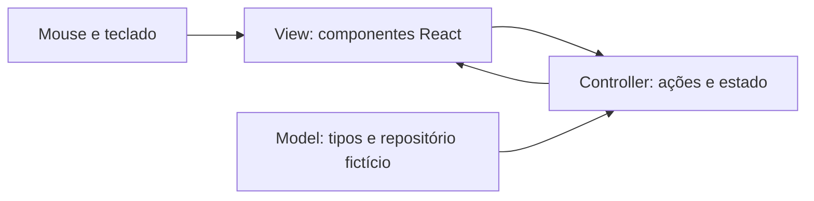

# SamusChat para computador — plano e protótipo MVC

Data: 06/10/2026.

Atualização em 09/10/2026: o protótipo evoluiu para um MVP integrado à API. O texto abaixo preserva o planejamento e o escopo da primeira versão; o comportamento atual está no [guia da integração desktop](DESKTOP_API.md).

## Objetivo e escopo

Criar primeiro um front para computador, com dados fictícios e navegação funcional, mantendo a identidade do Android. Validar essa interface antes de conectar à API existente. O destino final inclui navegador e aplicativo instalado; nesta etapa a execução é local no navegador, sem publicação ou instalador.

MVC descreve a organização do código (Model, View, Controller). MVP descreve uma entrega inicial. Esta entrega é um protótipo navegável organizado em MVC, adaptado ao fluxo declarativo do React.

## Tecnologias

| Tecnologia | Responsabilidade |
| --- | --- |
| TypeScript | Tipos de dados, contratos e lógica de interação |
| React 19 | Componentes e atualização da interface |
| CSS | Layout, responsividade e identidade visual |
| Vite 6 | Servidor de desenvolvimento e build estático |
| npm e package-lock.json | Instalação e versões reproduzíveis |
| Electron ou Tauri, etapa futura | Empacotamento desktop; decisão pendente após validar integrações |
| Spring Boot, PostgreSQL, Redis e REST/STOMP existentes | Backend e infraestrutura reaproveitados na integração futura |

React permite construir diretamente uma interface web que poderá ser usada no desktop. React Native exigiria suas camadas web/desktop e não reutilizaria diretamente as telas Android atuais em Kotlin/Compose. Não há migração do aplicativo Android nesta etapa.

Referências: [React](https://react.dev/), [TypeScript](https://www.typescriptlang.org/docs/), [Vite](https://vite.dev/guide/), [Electron](https://www.electronjs.org/docs/latest/), [Tauri](https://tauri.app/start/).

## Arquitetura

```text
samuschat-desktop/
  src/
    models/chat.ts                 Tipos e contrato do repositório
    models/mockRepository.ts       Servidores, conversas e mensagens fictícias
    controllers/useChatController.ts  Estado, seleção, busca, envio e perfil
    views/ChatApp.tsx               Interface e diálogo de perfil
    main.tsx                       Composição da aplicação
    styles.css                     Tema e layout
```



As Views apresentam os dados e encaminham eventos ao Controller. O Controller mantém o estado e valida as ações. O Model declara os dados e fornece as amostras. O contrato atual contém dados iniciais síncronos; na integração, será expandido com operações assíncronas de leitura e escrita e um adaptador API. O repositório fictício não implementa HTTP.

## Identidade e layout

Preservar as cores de `samuschat-android/.../ui/theme/Theme.kt`: barra `#1E1F22`, painel `#2B2D31`, conversa `#313338` e destaque `#5865F2`. Usar avatares, formas arredondadas e texto claro.

No desktop, a barra de servidores tem 76 px, o painel de canais/amigos tem 270 px e a conversa ocupa o restante. A edição de perfil fica no rodapé lateral. Abaixo de 900 px, os painéis ficam menores; abaixo de 620 px, a lista passa para cima da conversa. Um painel de membros pode ser acrescentado depois, quando houver dados e comportamento definidos.

## Entradas e comportamento implementado

| Entrada | Regra | Resultado |
| --- | --- | --- |
| Clique em servidor | ID existente na amostra | Abre seu primeiro canal; limpa busca e rascunho |
| Clique em Amigos | Área de conversas privadas | Abre a primeira conversa fictícia |
| Clique em canal/contato | ID existente na lista | Troca a conversa; limpa o rascunho |
| Busca | Texto, comparação sem distinguir maiúsculas | Filtra nomes na área atual; mostra estado sem resultados |
| Mensagem | Texto aparado, não vazio, até 2.000 caracteres | Adiciona mensagem somente ao histórico local da conversa |
| Enter / botão Enviar | Mesmas regras da mensagem | Envia localmente; composição de teclado não dispara envio |
| Shift + Enter | Campo de mensagem | Insere uma quebra de linha |
| Nome do perfil | Texto aparado, não vazio, até 40 caracteres | Atualiza o perfil e o autor das próximas mensagens |
| Cancelar / Escape no perfil | Diálogo aberto | Fecha sem salvar |

Os limites são decisões do protótipo; devem ser conciliados com as regras reais da API. Mensagens recebem UUID e horário do navegador. Ao recarregar, mensagens novas e alterações do perfil são descartadas. Não há senha, JWT, conexão de rede, armazenamento persistente, upload ou chamada nesta versão. Busca filtra canais/contatos, não o conteúdo das mensagens. Trocar de conversa descarta o rascunho, mas preserva mensagens enviadas enquanto a página permanece aberta.

## Entradas futuras da API

Contratos de referência: `samuschat-android/app/src/main/java/com/samuschat/data/api/ApiService.kt`. Confirmar também os DTOs e controllers do backend antes de integrar; os IDs textuais fictícios desta versão serão mapeados para os identificadores reais.

| Fluxo | Entrada futura |
| --- | --- |
| Login / cadastro | `POST /api/auth/login`, `POST /api/auth/register` |
| Recuperação de senha | `POST /api/auth/password/request`, `/verify`, `/reset` |
| Perfil | `GET /api/users/me`, `PUT /api/users/me/username?newUsername=...` |
| Servidores / canais | `GET /api/servers`, `GET /api/servers/{id}` |
| Histórico / envio em canal | `GET` e `POST /api/channels/{id}/messages` |
| Contatos | `GET /api/calls/contacts` |
| Mensagens privadas | `GET` e `POST /api/direct-messages?contact=...` |
| Eventos em tempo real | STOMP em `/ws/websocket`; contrato do Android como referência |

Na integração, planejar autenticação, configuração da URL da API, CORS/origens de WebSocket, estados de carregamento/erro, paginação, reconexão e deduplicação por ID. Não alterar o backend sem uma necessidade demonstrada de compatibilidade. Chamadas e captura de tela precisam de validação específica no navegador e no empacotador escolhido.

## Etapas

1. **Atual:** documentar e gerar a interface MVC com dados fictícios.
2. Revisar layout, dimensões e interações com o usuário.
3. Acrescentar telas de autenticação e estados de carregamento/erro antes de conectar esses fluxos.
4. Integrar REST e STOMP ao backend, validando com duas contas reais.
5. Integrar chamadas, anexos e compartilhamento de tela conforme contratos e suporte das plataformas.
6. Escolher o empacotador, gerar o instalador e validar permissões, notificações e distribuição. Publicação será tratada nessa etapa.

## Executar e validar

Pré-requisito: Node.js 22 e npm. A API, o Docker e o Android Studio não são necessários para o protótipo.

```powershell
cd samuschat-desktop
npm ci
npm run dev
```

Abra o endereço informado pelo Vite, normalmente `http://127.0.0.1:5173`. Para verificar TypeScript e gerar os arquivos estáticos: `npm run build`. Para servir o build: `npm run preview`.

Roteiro de revisão: alternar os dois servidores, abrir cada canal, buscar um nome inexistente, abrir Amigos, enviar uma mensagem com Enter e outra com quebra de linha, verificar isolamento entre conversas, editar/cancelar o perfil, navegar por Tab e testar redimensionamento. Recarregar deve restaurar as amostras originais. O sucesso do build verifica tipos e empacotamento; não substitui a revisão visual e de interação no navegador.

Validação em 06/10/2026: `npm run build` concluído, com verificação TypeScript e build Vite 6.4.4. Revisão visual e execução do roteiro manual ainda pendentes; o ambiente desta sessão não disponibiliza controle de navegador.
