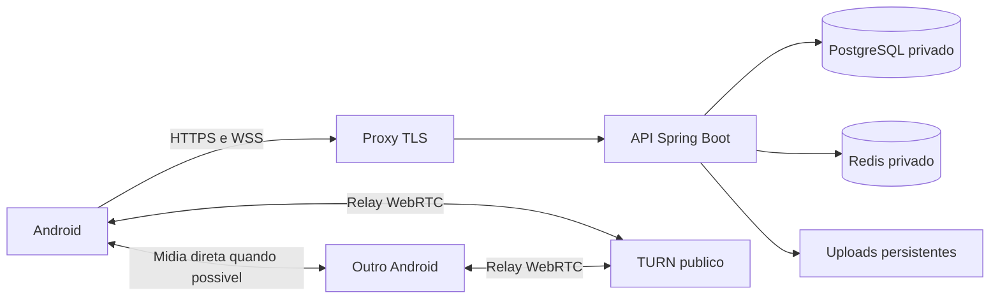

# Estudo: hospedagem, celulares reais e atualizacoes

Pesquisa realizada em 07/10/2026. Este documento orienta a decisao; nao contrata infraestrutura, publica APKs nem ativa deploy. Correcoes do produto e abertura de beta continuam como etapas posteriores.

## Como o projeto funciona hoje

- Android: Kotlin/Compose e WebRTC. A API e definida no build por `apiBaseUrl`; o padrao `10.0.2.2` atende emuladores, nao celulares fisicos.
- API: Spring Boot/Java 21, autenticacao JWT, REST e WebSocket, PostgreSQL, Redis e uploads em disco.
- Chamadas: a API sinaliza convite e SDP; a midia vai entre clientes ou por TURN. O backend Java nao e um servidor de video.
- Salas: malha de conexoes entre participantes; o custo de upload dos clientes cresce com os participantes. Um SFU seria outra arquitetura, a estudar se a escala exigir.
- Producao preparada: Dockerfile, Compose com tres backends, PostgreSQL, Redis master/replica, Nginx e scripts de deploy/rollback. Isso roda em um unico host e nao garante alta disponibilidade.
- Lacunas para publicar: o Compose nao entrega HTTPS com certificado nem instala Coturn; uploads precisam de persistencia; chaves, SMTP, configuracao Google/Firebase e backups precisam ser definidos.
- O workflow ja valida branches `feature/**`, `main` e `develop`; publicacao da imagem e deploy exigem ativacao/configuracao especifica. Fazer push nesta branch nao publica automaticamente o app nem o servidor.

## Testar celulares antes de contratar um servidor

### USB, para a primeira validacao

Ativar depuracao USB, conectar o cabo e autorizar o computador. Conferir `adb devices -l`; o status precisa ser `device`, nao `unauthorized`. Windows pode exigir driver do fabricante. [Android: dispositivos fisicos](https://developer.android.com/studio/run/device).

O build `validation` tem pacote `com.samuschat.validation`, nome `SamusChat Teste` e dados separados do app normal. Usa a mesma implementacao, mas nao testa assinatura de producao, Google/Firebase para esse pacote nem entrega pela loja. [Android: variantes](https://developer.android.com/build/build-variants).

```powershell
# Na pasta samuschat-android, com ANDROID_HOME configurado:
.\gradlew.bat :app:assembleValidation '-PapiBaseUrl=http://127.0.0.1:8081/' -PcallsForceRelay=true

# Na raiz, uma vez para cada serial fisico autorizado:
$taskAdb = '.\.android-sdk\platform-tools\adb.exe'
& $taskAdb -s SERIAL reverse tcp:8081 tcp:8081
& $taskAdb -s SERIAL install -r samuschat-android/app/build/outputs/apk/validation/app-validation.apk
& $taskAdb -s SERIAL shell am start -n com.samuschat.validation/com.samuschat.MainActivity
```

`adb reverse` encaminha a API TCP para o computador. Nao encaminha UDP nem transforma o TURN configurado para `10.0.2.2` em TURN de celular. Para testar midia por USB, e necessario preparar TURN TCP com endereco correto e outro encaminhamento; essa combinacao ainda nao foi validada nesta rodada. Para encerrar o encaminhamento: `adb -s SERIAL reverse --remove tcp:8081`.

Somente o APK debug/validation permite HTTP de desenvolvimento. Release deve acessar HTTPS. Os testes usam contas ficticias e nunca limpam os dados do app pessoal.

### Wi-Fi local

Usar o IP local do computador na URL de build, API ouvindo na interface apropriada e regra de firewall restrita a rede de teste. A configuracao do TURN deve anunciar endereco e portas alcancaveis pelos celulares. Dois telefones no mesmo Wi-Fi nao validam NAT de operadora. Depuracao sem fio no Android 11+ exige pareamento e rede compativel. [Android: conexao Wi-Fi](https://developer.android.com/studio/run/device#connect-to-your-device-using-wi-fi).

### Wi-Fi e dados moveis, com acesso externo

Usar API publica HTTPS e TURN publico, contas de teste e celulares em redes diferentes. Primeiro conectar em cada rede; depois trocar Wi-Fi/dados durante uma chamada e medir o que acontece. API por tunel HTTP ajuda a testar REST, mas nao substitui o servidor TURN nem seus transportes.

O segundo celular esta indisponivel nesta sessao. Testes com operadora, qualidade acustica, eco e Bluetooth permanecem pendentes. Firebase Test Lab pode ampliar cobertura de aparelhos, mas nao substitui a conversa real entre dois usuarios em operadoras diferentes. [Android: teste em hardware](https://developer.android.com/studio/run/device).

## Opcoes para hospedar

| Opcao | Adequacao ao SamusChat | Trabalho e limites |
| --- | --- | --- |
| VPS Linux com Docker | Mais proxima do Compose atual; controla HTTPS, TCP/UDP e TURN | Administrar SO, firewall, certificados, monitoramento e backups; um host continua sendo ponto unico de falha |
| Plataforma gerenciada, como Render pago | Simplifica API, TLS e deploy; suporta WebSocket | Banco/Redis e armazenamento persistente precisam de desenho proprio; TURN precisa de servico adequado separado |
| Cloud Run + servicos gerenciados | Pode servir a API e WebSocket com adaptacoes | Reconexao, timeouts e estado compartilhado precisam ser validados; banco, uploads e TURN ficam separados |
| Computador pessoal/tunel temporario | Serve a testes pontuais | Depende do computador ligado e da rede local; nao e o servidor permanente proposto |

Render Free suspende servicos ociosos e nao oferece disco persistente; uploads locais podem desaparecer. Portanto, nao e a proposta para esta aplicacao com chamadas e dados persistentes. [Limites oficiais](https://render.com/docs/free). Render suporta WebSocket, mas isso nao significa suporte a toda a infraestrutura de relay de midia. [WebSocket no Render](https://render.com/docs/websocket).

Cloud Run suporta WebSocket, sujeito a timeout, com necessidade de reconexao e sincronizacao entre instancias. Sua afinidade e de melhor esforco. [Documentacao oficial](https://docs.cloud.google.com/run/docs/triggering/websockets).

Como inferencia a partir do repositorio, a opcao inicial mais direta e uma VPS para staging, com dominio separado e TURN. Para um piloto pequeno, estudar um backend em vez de assumir que os tres atuais sao necessarios. Como ponto inicial de planejamento, comparar 2 vCPU/4 GB para uma instancia e 4 vCPU/8 GB para o Compose mais completo; esses tamanhos nao foram aprovados por teste de carga e nao prometem capacidade de usuarios.

DigitalOcean e Hetzner sao exemplos para cotacao, sem escolha ou contratacao nesta etapa. Conferir regiao, latencia para usuarios brasileiros, IPv4, franquia de transferencia, backup e preco vigente nas paginas oficiais: [DigitalOcean](https://docs.digitalocean.com/products/droplets/details/pricing/), [Hetzner](https://docs.hetzner.com/cloud/servers/overview/).

## Como ficaria o servidor proposto



API em `api.dominio`, TURN em `turn.dominio`, staging separado de producao. Publicar 443/TCP para API; se usar ACME HTTP-01, 80/TCP para certificado/redirecionamento. TURN costuma usar 3478 UDP/TCP, opcionalmente 5349/TCP para TLS e uma faixa UDP de relay definida no Coturn. Definir a faixa e liberar exatamente as portas adotadas; nao copiar o TURN local de localhost para producao. [Configuracao Coturn](https://github.com/coturn/coturn/blob/master/examples/etc/turnserver.conf).

Banco 5432 e Redis 6379 ficam privados. SSH restrito aos administradores. Segredo TURN permanece no servidor; clientes recebem credenciais temporarias. A implementacao atual nao renova essas credenciais durante chamadas longas, o que precisa de teste antes de prometer duracao ilimitada.

Guardar PostgreSQL e uploads em volumes persistentes; backup externo com teste de restauracao. Redis Pub/Sub distribui mensagens, mas nao substitui o historico no banco. Com varios hosts, os uploads atuais em volume Docker local precisariam de armazenamento compartilhado ou objeto e ajuste no aplicativo.

Monitorar saude da API/banco/Redis, memoria, disco, erros, conexoes WebSocket, uso do TURN e trafego. O custo deve incluir computacao, banco, armazenamento, backups, dominio, SMTP e transferencia de midia. Como estimativa aritmetica, 1 Mbit/s de trafego constante corresponde a aproximadamente 0,45 GB por hora em uma direcao, sem overhead; multiplique pelos fluxos de relay e tempo de uso. A medicao real deve orientar a contratacao.

## Atualizar o aplicativo e o servidor

| Metodo | Quando usar | Como recebe a versao nova |
| --- | --- | --- |
| APK por USB (`adb install -r`) | Desenvolvimento local | Instalar novamente pelo computador |
| APK assinado por download HTTPS | Pequeno grupo controlado | Baixar e confirmar instalacao; exige distribuicao e assinatura consistentes |
| Firebase App Distribution | Testadores convidados | Receber convite/notificacao e instalar a release disponibilizada |
| Google Play, trilha interna/fechada | Testes via loja e futura distribuicao | Atualizar pela Play Store, conforme trilha e configuracoes do aparelho |

Para atualizar sem reinstalacao limpa, manter identidade do pacote e assinatura compativel; incrementar `versionCode` em cada release. Hoje o app normal esta em `versionCode=2`, `versionName=1.1.0`; nao ha uma politica automatizada de incremento. Debug e producao nao devem depender de uma chave debug compartilhada. Guardar a chave de assinatura/upload fora do Git e definir a estrategia antes da primeira distribuicao. [Assinatura](https://developer.android.com/studio/publish/app-signing), [versionamento](https://developer.android.com/studio/publish/versioning).

Firebase App Distribution distribui builds para testadores e informa releases novas; nao atualiza silenciosamente o app. [Guia oficial](https://firebase.google.com/docs/app-distribution/android/distribute-console). Play oferece trilhas de teste; requisitos variam conforme a conta e devem ser conferidos antes de publicar. [Trilhas](https://support.google.com/googleplay/android-developer/answer/9845334). Atualizacao dentro do app com Play e uma integracao futura, nao uma funcionalidade atual. [In-app updates](https://developer.android.com/guide/playcore/in-app-updates).

O servidor atualiza independentemente do APK: testes, imagem GHCR identificada pelo SHA, deploy em staging, migracao Flyway, verificacao de saude e depois producao. O projeto ja tem scripts para releases e rollback de imagem, mas isso nao desfaz automaticamente migracoes de banco. Manter compatibilidade com versoes anteriores do Android durante o periodo de atualizacao. Endpoint de versao minima e aviso de upgrade seriam trabalho futuro, nao implementado aqui.

## Decisoes antes das etapas 4 e 5

1. Conseguir o segundo celular e executar a matriz fisica, incluindo Wi-Fi/dados.
2. Escolher VPS ou plataforma gerenciada, teto mensal de custo e regiao.
3. Definir dominio, HTTPS, TURN publico, persistencia e restauracao de backups.
4. Definir pacote/assinatura de staging e producao e canal de distribuicao.
5. Selecionar os problemas encontrados para a etapa 4; so depois preparar a beta da etapa 5.
