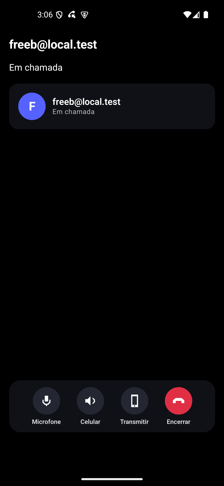

# Regressao de chamadas, transmissao e estabilidade — 08/10/2026

Retomada apos o usuario liberar espaco. Esta execucao substitui a pendencia de midia em emuladores da [tentativa anterior](VALIDACAO_CHAMADAS_TRANSMISSAO_ESTABILIDADE.md); a validacao em celulares fisicos continua pendente.

## Ambiente e resultado

**Execucao completa aprovada**, `passed=true`, concluida em 08/10/2026 as 00:09:10, America/Sao_Paulo.

- Dois clientes Android API 35: emulador existente `emulator-5554` e novo AVD de teste `SamusChat_Midia_B`, na porta 5556.
- Pacote separado `com.samuschat.validation`, com contas ficticias; o app normal e seus dados foram preservados.
- API na porta 8081, perfil `test`, banco H2 em memoria; sem alterar PostgreSQL de desenvolvimento.
- TURN Coturn local, clientes forcados a relay; candidatos relay observados nos dois lados.
- Cerca de 20 GB livres no inicio; apenas um emulador adicional, para reduzir pressao de memoria. O cliente novo confirmou boot em 38 segundos.

## Evidencias por cenario

| Cenario | Resultado |
| --- | --- |
| Convite e aceite | Ambos os clientes conectados |
| Viva-voz | Alternancia de estado e comando aprovada; qualidade acustica nao medida |
| Segundo plano e tela bloqueada | Peer continuou em chamada; mesmo processo do caller depois do retorno |
| Microfone | 25 ciclos, 50 toques; processos preservados e chamada mantida |
| Compartilhamento de tela | Video decodificado; maior amostra observada: 277 frames |
| Previa e receptor | Primeiro frame renderizado nos dois lados; capturas reais conferidas |
| Audio do dispositivo | 650 pacotes e 196.217 amostras nao nulas na medicao com captura permitida |
| Captura proibida pelo app auxiliar | Pacotes continuaram aumentando, sem aumento de amostras nao nulas apos estabilizacao |
| Parar e reiniciar transmissao | Previa removida ao parar; nova autorizacao e estado de compartilhamento retomados |
| Encerrar remotamente durante captura | Dialogos de chamada removidos e recursos liberados |
| Convite no sentido inverso e recusa | Ambos retornaram ao estado disponivel |
| Interrupcao abrupta do peer | Cliente de teste receptor encerrado; caller saiu da chamada dentro da janela de 90 segundos do roteiro |
| Servico de midia e crashes | Servico ausente nos dois pacotes ao final; sem `FATAL EXCEPTION` nos logs examinados |

Os numeros de pacotes, amostras e frames sao evidencias desta execucao, nao metas de desempenho ou teste de carga. O tom de 440 Hz vem do APK auxiliar `com.samuschat.calltest`, separado do SamusChat.

## Capturas da rodada aprovada




## Ajustes no roteiro e tentativas reprovadas

As tentativas anteriores desta retomada nao contam como aprovadas. O primeiro erro foi um seletor com `Parar transmiss?o` em lugar do texto correto. Depois, o roteiro tentou tocar no rotulo `Parar tela`, que esta fora do botao clicavel. Os seletores passaram a usar as descricoes acessiveis `Parar transmissão` e `Encerrar chamada`; o arquivo foi salvo como UTF-8 com BOM para Windows PowerShell.

Essas correcoes foram feitas somente no roteiro. Nenhuma correcao do codigo do produto foi aplicada nesta retomada. Depois delas, a suite inteira foi repetida, desde a preparacao das contas, e passou.

## Limites e proximo passo

Esta rodada valida os tres pontos no ambiente de emuladores: chamada, midia e os cenarios de estabilidade descritos. Nao valida microfone/alto-falante fisicos, eco, Bluetooth, chamadas longas, diferentes fabricantes, operadoras ou troca Wi-Fi/dados moveis. O teste de interrupcao encerra o processo do peer; nao equivale a um teste de perda de rede ou reconexao automatica.

O segundo celular continua indisponivel. A matriz fisica permanece pendente, especialmente os cenarios E04–E06 do [roteiro](VALIDACAO_CHAMADAS_TRANSMISSAO_ESTABILIDADE.md). Antes das etapas 4 e 5, revisar o [estudo de hospedagem e atualizacoes](ESTUDO_HOSPEDAGEM_CELULARES_ATUALIZACOES.md), escolher o acesso publico da API/TURN e completar os testes nos aparelhos.

## Reproducao e arquivos locais

Com APK validation, app de tom, API/TURN de teste e dois clientes prontos, executar na raiz:

```powershell
$taskAdb = '.\.android-sdk\platform-tools\adb.exe'
& $taskAdb -s emulator-5554 reverse tcp:8081 tcp:8081
& $taskAdb -s emulator-5556 reverse tcp:8081 tcp:8081
powershell.exe -NoProfile -ExecutionPolicy Bypass -File scripts/test-calls-emulator.ps1 `
  -Adb $taskAdb -Caller emulator-5554 -Callee emulator-5556 `
  -Prepare -IsolatedApp -AppPackage com.samuschat.validation
```

Relatorio e logs completos, fora do Git:

- `samuschat-android/app/build/call-e2e/result.json`, `caller.log`, `callee.log` e `*-final.log`.
- `logs/media-retry-success.json` e `logs/media-retry-e2e.log`.
- `logs/media-retry-selector-failure.*` e `logs/media-retry-label-failure.*`: tentativas anteriores reprovadas.
- `logs/media-retry-emulator.stdout.log` e `chatapp-backend/target/media-retry-api.log`.

As capturas deste documento usam somente contas ficticias. Ao final, os pacotes de teste foram fechados, os encaminhamentos TCP retirados e API H2, TURN e emulador adicional encerrados. O app normal e a instancia pessoal permaneceram preservados. O AVD de teste foi mantido localmente, fora do Git, para futuras execucoes.
